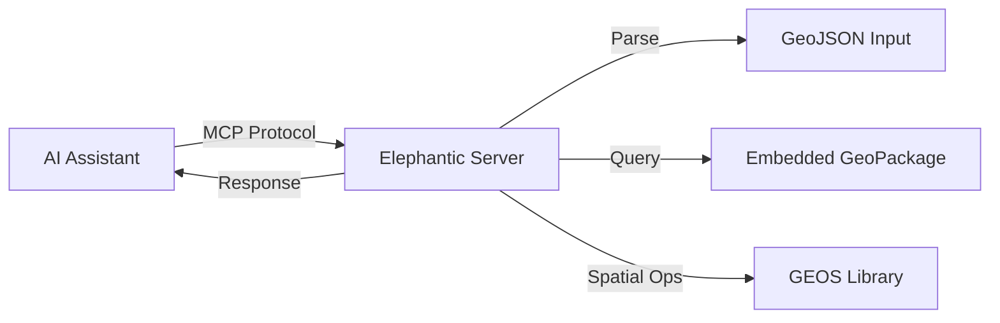

# Elephantic Specification

## Overview

Elephantic is a minimal MCP (Model Context Protocol) server that counts GeoJSON points by country using embedded Natural Earth boundaries.

## Architecture



## User Stories

### US-001: Count Points by Country
**As** an AI assistant user
**I want** to determine which countries contain my geographic points
**So that** I can analyze spatial distribution of data

**Acceptance Criteria:**
- Input accepts valid GeoJSON FeatureCollection with Point geometries
- Output returns ISO country codes with point counts
- Processing completes within reasonable time for large datasets
- Invalid geometries are counted as errors, not failures

## Functional Requirements

### FR-001: GeoJSON Input
- Accept GeoJSON FeatureCollection as string input
- Extract Point geometries from features
- Discard all feature attributes
- Handle both 2D and 3D coordinates

### FR-002: Country Matching
- Use embedded Natural Earth 10m country boundaries
- Match points using GEOS point-in-polygon operations
- Return ISO 3166-1 alpha-3 country codes
- Handle points in disputed territories gracefully

### FR-003: Parallel Processing
- Distribute point processing across CPU cores
- Maintain thread safety with per-worker GEOS contexts
- Use buffered channels for work distribution

### FR-004: MCP Server
- Implement MCP protocol over stdio
- Register single tool: `count_points_by_country`
- Return structured JSON responses

## Non-Functional Requirements

### NFR-001: Performance
- Process 10,000 points in under 5 seconds
- Scale linearly with CPU cores
- Use prepared geometries for O(log n) lookups

### NFR-002: Scalability
- Support thousands of simultaneous connections
- Stateless request handling
- Single-process memory efficiency

### NFR-003: Reliability
- Graceful error handling
- Never crash on malformed input
- Report processing errors in response

## Technical Stack

| Component | Technology |
|-----------|------------|
| Language | Go 1.22 |
| Spatial Library | GEOS via go-geos |
| Database | SQLite (embedded GeoPackage) |
| Protocol | MCP over stdio |

## Data Format

### Input
```json
{
  "type": "FeatureCollection",
  "features": [
    {
      "type": "Feature",
      "geometry": {
        "type": "Point",
        "coordinates": [0.0, 0.0]
      }
    }
  ]
}
```

### Output
```json
{
  "counts": {
    "US": 100,
    "CA": 50
  },
  "total": 150,
  "errors": 0
}
```

## Version History

| Version | Date | Changes |
|---------|------|---------|
| 1.0.0 | 2026-03-12 | Initial release |
